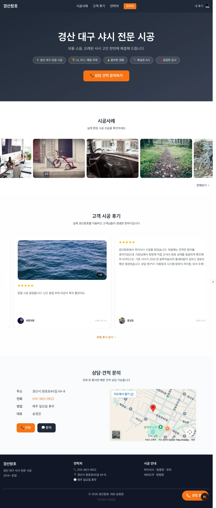
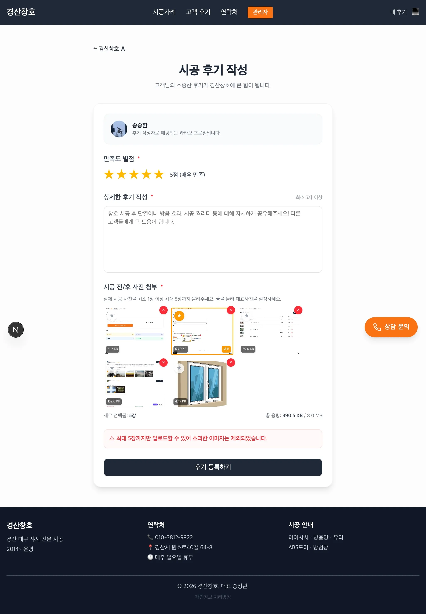
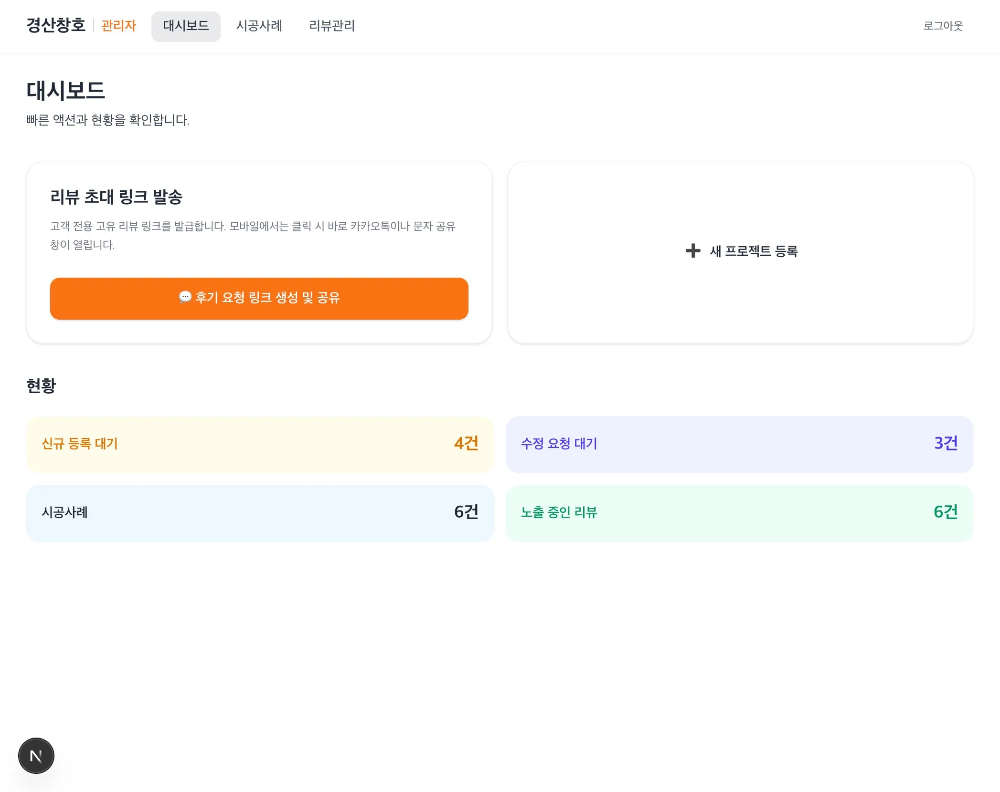
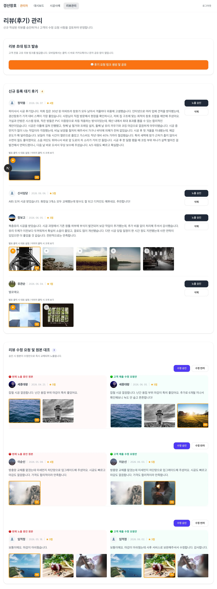
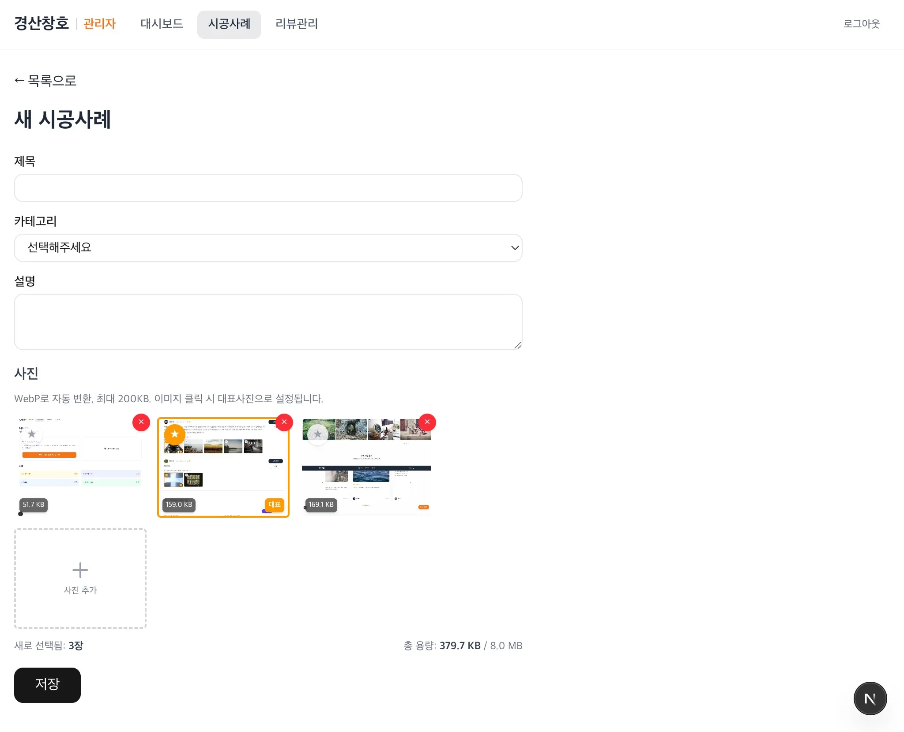

# Potato — 풀스택 비즈니스 홈페이지 + 관리자 CMS

실제 운영 중인 시공 업체 홈페이지. 공개 랜딩 페이지와 관리자 CMS를 하나의 Next.js 앱으로 구현했습니다.

> Next.js 16 (App Router) · React 19 · TypeScript (strict) · Supabase · Auth.js v5 · Tailwind CSS 4 · Vercel

🔗 [Live Demo](https://potato-swart.vercel.app)

## 스크린샷

|              공개 홈페이지               |                      고객 후기 작성                      |
| :--------------------------------------: | :------------------------------------------------------: |
|  |  |

|                  고객 후기 목록                   |                  관리자 대시보드                   |
| :-----------------------------------------------: | :------------------------------------------------: |
|  |  |

|                 관리자 리뷰 관리                 |                        시공사례 등록                         |
| :----------------------------------------------: | :----------------------------------------------------------: |
|  |  |

## 주요 특징

- **Repository 패턴** — Supabase 미연결 시 Mock으로 자동 전환. DB 없이 개발/빌드 가능
- **Server Actions** — 오케스트레이션만 담당, 순수 로직은 분리하여 단위 테스트 가능
- **서버/클라이언트/공용 3분할** — 폴더 경계를 넘는 import 금지로 관심사 분리
- **Auth.js v5 카카오 로그인** — 환경변수 기반 관리자 권한 제어 (DB 변경 불필요)
- **이미지 최적화** — 브라우저에서 WebP 변환 + 200KB 압축 후 Supabase Storage 업로드
- **환경변수 빌드타임 검증** — Zod 스키마로 필수 환경변수 누락 시 빌드 차단
- **Discord 웹훅 모니터링** — 에러(🔴)/보안(🟡) 이원화 채널, Non-blocking 전송
- **SEO** — 구조화 데이터(JSON-LD), 동적 사이트맵, 페이지별 OG/canonical
- **로컬 SEO / GEO 최적화** — HomeAndConstructionBusiness 스키마, 절대경로 canonical 고정, sitemap 엣지 캐싱, 고객 후기 연동을 통한 인용 신뢰도 확보

## 주요 기능

- **시공사례 갤러리** — 카테고리 필터 + 이미지 라이트박스 + 관리자 CRUD
- **고객 후기 시스템** — 카카오 로그인 인증 → 별점/대표사진 선택 → 관리자 승인 후 노출
- **후기 수정 파이프라인** — 원본 유지 + 수정 요청 대기 → 관리자가 원본/수정안 대조 후 승인/반려
- **관리자 대시보드** — 빠른 액션(초대 링크, 프로젝트 등록) + 현황 카드
- **리뷰 초대 링크** — UUID v7 기반 1회용 링크 생성 + 모바일 공유 API 연동
- **실시간 알림** — 에러/보안 이벤트 Discord 즉시 전송 (Sentry 대체)

## 기술 스택

| 분류         | 기술                                        |
| ------------ | ------------------------------------------- |
| Framework    | Next.js 16 (App Router) + TypeScript strict |
| Styling      | Tailwind CSS 4 + shadcn/ui                  |
| DB / Storage | Supabase (PostgreSQL + Storage)             |
| Auth         | Auth.js v5 — 카카오 소셜 로그인             |
| Forms        | react-hook-form + Zod                       |
| Monitoring   | Discord Webhook (에러/경고 이원화)          |
| Migration    | Supabase CLI (Code-First)                   |
| Test         | Vitest + Testing Library + Playwright       |
| Deploy       | Vercel                                      |
| Code Quality | ESLint, Prettier, Husky, commitlint         |

## 프로젝트 구조

```
src/
├── app/
│   ├── (public)/        # 공개 페이지 (랜딩, 시공사례, 고객 후기)
│   ├── admin/           # 관리자 CRUD (카카오 로그인 보호)
│   └── _components/     # 공용 UI 컴포넌트
├── server/              # Repository (Supabase ↔ Mock 자동 전환), Logger
├── client/              # 브라우저 유틸 (이미지 압축, 테마)
└── shared/              # 타입, Zod 스키마, 환경변수 검증 (양쪽 공용)
```

## 설계 결정

주요 기술 선택의 이유는 문서로 기록했습니다:

- [`docs/ADR.md`](docs/ADR.md) — Architecture Decision Records
- [`docs/ARCHITECTURE.md`](docs/ARCHITECTURE.md) — 시스템 아키텍처
- [`docs/CODE_STYLE.md`](docs/CODE_STYLE.md) — 코딩 컨벤션
- [`docs/SEO.md`](docs/SEO.md) — SEO 전략 및 적용 현황
- [`docs/features/reviews-dev-plan.md`](docs/features/reviews-dev-plan.md) — 후기 시스템 개발 계획서 및 설정 가이드

## 시작하기

```bash
pnpm install
cp .env.local.example .env.local  # 환경변수 설정
pnpm dev                          # http://localhost:3000
pnpm test                         # 단위/통합/컴포넌트 테스트 (Vitest)
pnpm test:e2e                     # E2E 시나리오 테스트 (Playwright)
pnpm build                        # 프로덕션 빌드
```

Supabase 미연결 시에도 Mock 데이터로 정상 동작합니다.
